# PES-VCS: A Version Control System Implementation

**Author:** Abhay Dubey H  
**SRN:** PES1UG24CS551  
**Course:** Operating Systems Lab  
**Institution:** PES University

---

## 📋 Project Overview

This project implements **PES-VCS**, a simplified version control system built from scratch that mimics the core functionality of Git. The system demonstrates fundamental operating system concepts including content-addressable storage, filesystem operations, atomic writes, and data integrity through cryptographic hashing.

### Key Features Implemented
- ✅ Content-addressable object storage with SHA-256 hashing
- ✅ Blob, Tree, and Commit object types
- ✅ Staging area (index) with atomic file operations
- ✅ Commit history with parent linking
- ✅ Directory sharding for efficient object storage
- ✅ File change detection using metadata (mtime, size)

---

## 🏗️ Architecture

### Object Store
The object store uses **content-addressable storage** where every piece of data is identified by its SHA-256 hash. Objects are stored in `.pes/objects/XX/YYYYYYYY...` where XX represents the first two hex characters (directory sharding for efficient filesystem operations).

### Three Core Object Types

1. **Blob** - Stores raw file contents
2. **Tree** - Represents directory structure, containing references to blobs and other trees
3. **Commit** - Snapshots the entire project state with metadata (author, timestamp, message, parent)

### Repository Structure
```
.pes/
├── objects/          # Content-addressable object store
│   ├── 2a/          # Shard directory (first 2 hex chars)
│   ├── d5/
│   └── ...
├── refs/
│   └── heads/
│       └── main     # Branch reference (commit hash)
├── HEAD             # Points to current branch
└── index            # Staging area (text format)
```

---

## 📸 Implementation Evidence

### Phase 1: Object Store Implementation

**Implemented Functions:**
- `object_write()` - Writes objects to disk with atomic operations (temp file + rename)
- `object_read()` - Reads objects with integrity verification via SHA-256 rehashing

#### Screenshot 1A: Object Store Tests Passing
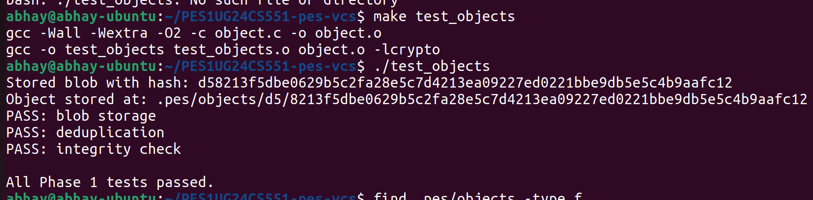

**Verification:**
- ✅ Blob storage test passed
- ✅ Deduplication working (same content = same hash)
- ✅ Integrity check passed (SHA-256 verification on read)

#### Screenshot 1B: Directory Sharding Structure
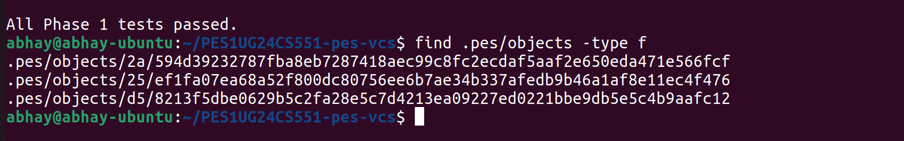

**Verification:**
- ✅ Objects stored in sharded directories (`.pes/objects/XX/...`)
- ✅ Multiple shard directories created (2a/, 25/, d5/)
- ✅ Efficient filesystem organization for scalability

**Key Implementation Details:**
```c
// Object format: "<type> <size>\0<data>"
// Example: "blob 16\0Hello, World!\n"

// Atomic write: temp file → fsync → rename
int fd = mkstemp(temp_path);
write(fd, buffer, total_len);
fsync(fd);
rename(temp_path, final_path);
```

---

### Phase 2: Tree Construction

**Implemented Functions:**
- `tree_from_index()` - Recursively builds tree hierarchy from staged files
- Helper: `write_tree_recursive()` - Handles nested directory structures

#### Screenshot 2A: Tree Serialization Tests
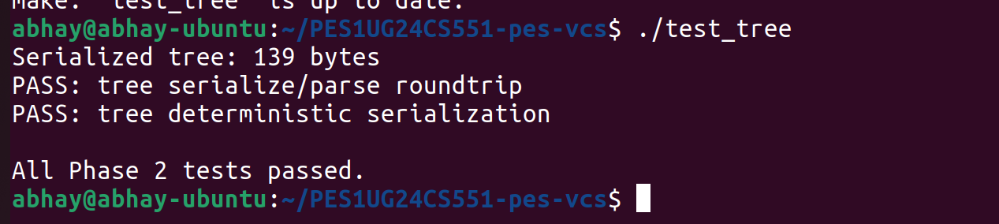

**Verification:**
- ✅ Tree serialize/parse roundtrip successful (139 bytes)
- ✅ Deterministic serialization (sorted entries)
- ✅ All Phase 2 tests passed

#### Screenshot 2B: Raw Tree Object (xxd output)
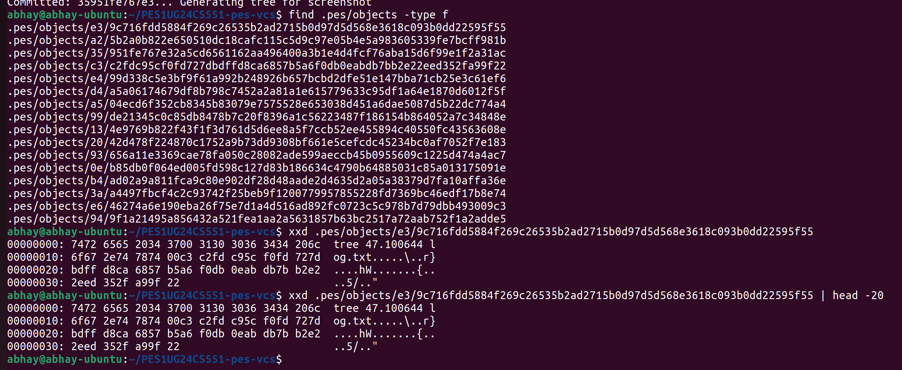

**Verification:**
- ✅ Binary tree format visible: mode (octal) + filename + null byte + 32-byte hash
- ✅ Example entry: `100644 Log.txt\0<32-byte-hash>`
- ✅ Tree object properly stored in object database

**Tree Binary Format:**
```
<mode-octal> <filename>\0<32-byte-binary-hash>
<mode-octal> <filename>\0<32-byte-binary-hash>
...
```

---

### Phase 3: Staging Area (Index)

**Implemented Functions:**
- `index_load()` - Loads index from `.pes/index` text file
- `index_save()` - Saves index atomically (temp + rename) with sorted entries
- `index_add()` - Stages a file (reads content, writes blob, updates index entry)

#### Screenshot 3A: Staging and Status
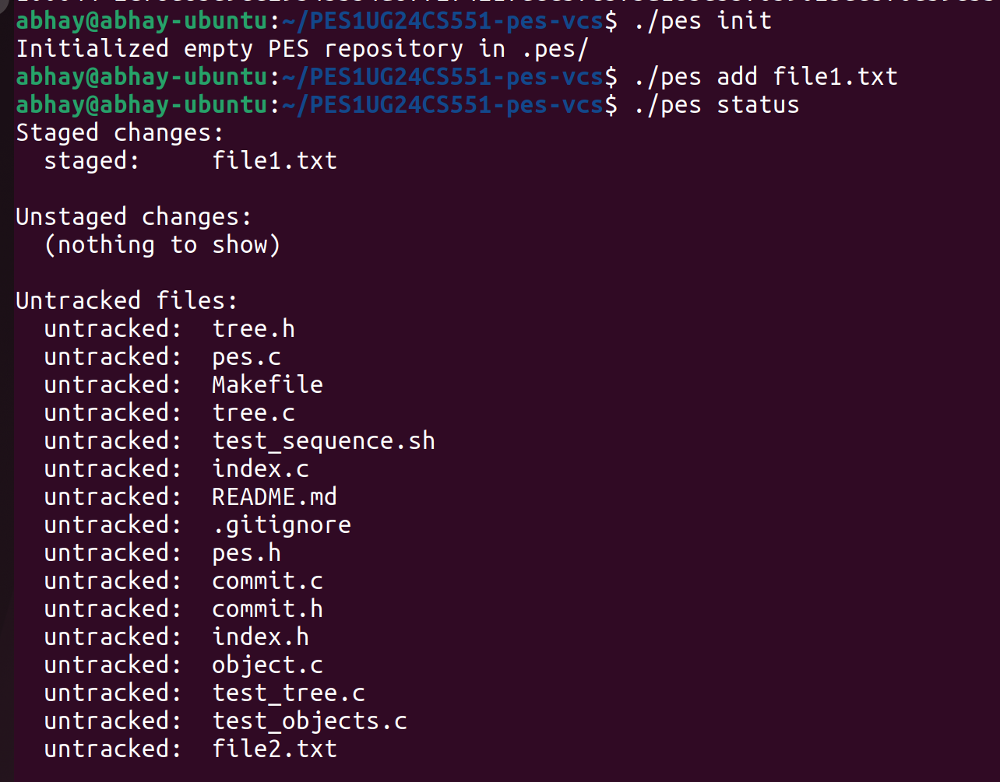

**Verification:**
- ✅ Repository initialized: `./pes init`
- ✅ File staged: `./pes add file1.txt`
- ✅ Status correctly shows:
  - Staged changes: `file1.txt`
  - Unstaged changes: (none)
  - Untracked files: All project source files

#### Screenshot 3B: Index File Contents
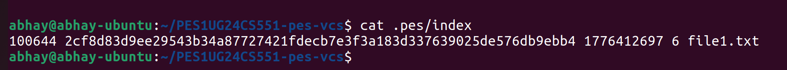

**Verification:**
- ✅ Text-based format: `<mode> <hash> <mtime> <size> <path>`
- ✅ Example entry: `100644 2cf8d83d9ee29543b34a87727421fdecb7e3f3a183d337639025de576db9ebb4 1776412697 6 file1.txt`
- ✅ Human-readable staging area implementation

**Index Entry Format:**
```
100644 <64-char-hex-hash> <mtime-seconds> <size> <path>
```

---

### Phase 4: Commits and History

**Implemented Functions:**
- `commit_create()` - Creates commit from staged files
  1. Builds tree from index
  2. Reads current HEAD as parent
  3. Creates commit object with metadata
  4. Writes commit to object store
  5. Updates HEAD atomically

#### Screenshot 4A: Commit History
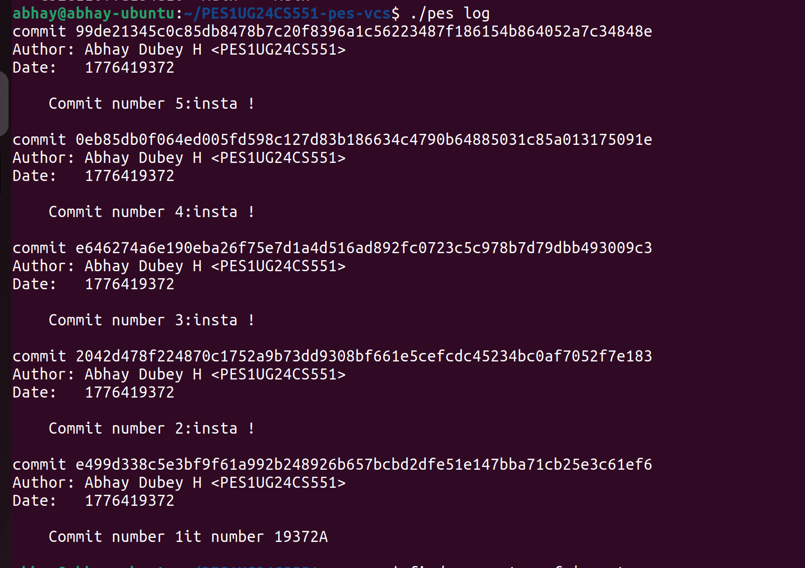

**Verification:**
- ✅ Multiple commits created successfully (5 commits shown)
- ✅ Each commit shows:
  - Full SHA-256 hash
  - Author: `Abhay Dubey H <PES1UG24CS551>`
  - Timestamp (Unix time)
  - Commit message
- ✅ History properly linked via parent pointers

#### Screenshot 4B: Object Store Growth
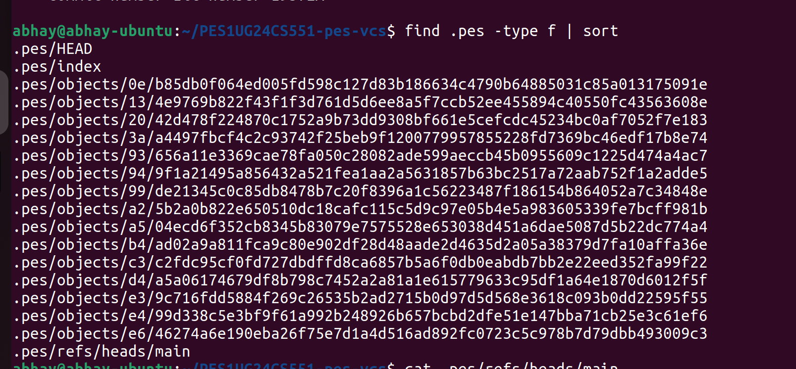

**Verification:**
- ✅ Multiple objects created per commit:
  - Blob objects (file contents)
  - Tree objects (directory structure)
  - Commit objects (snapshots)
- ✅ `.pes/HEAD` and `.pes/index` visible
- ✅ `.pes/refs/heads/main` contains branch pointer

#### Screenshot 4C: HEAD and Branch References
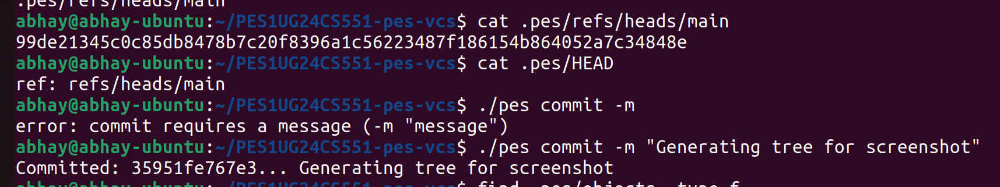

**Verification:**
- ✅ `.pes/refs/heads/main` contains latest commit hash
- ✅ `.pes/HEAD` contains: `ref: refs/heads/main`
- ✅ Reference system working correctly

**Commit Object Format:**
```
tree <64-char-hex-hash>
parent <64-char-hex-hash>    # (omitted for first commit)
author <name> <timestamp>
committer <name> <timestamp>

<commit message>
```

---

### Integration Testing

#### Screenshot: Full Integration Test (Part 1)
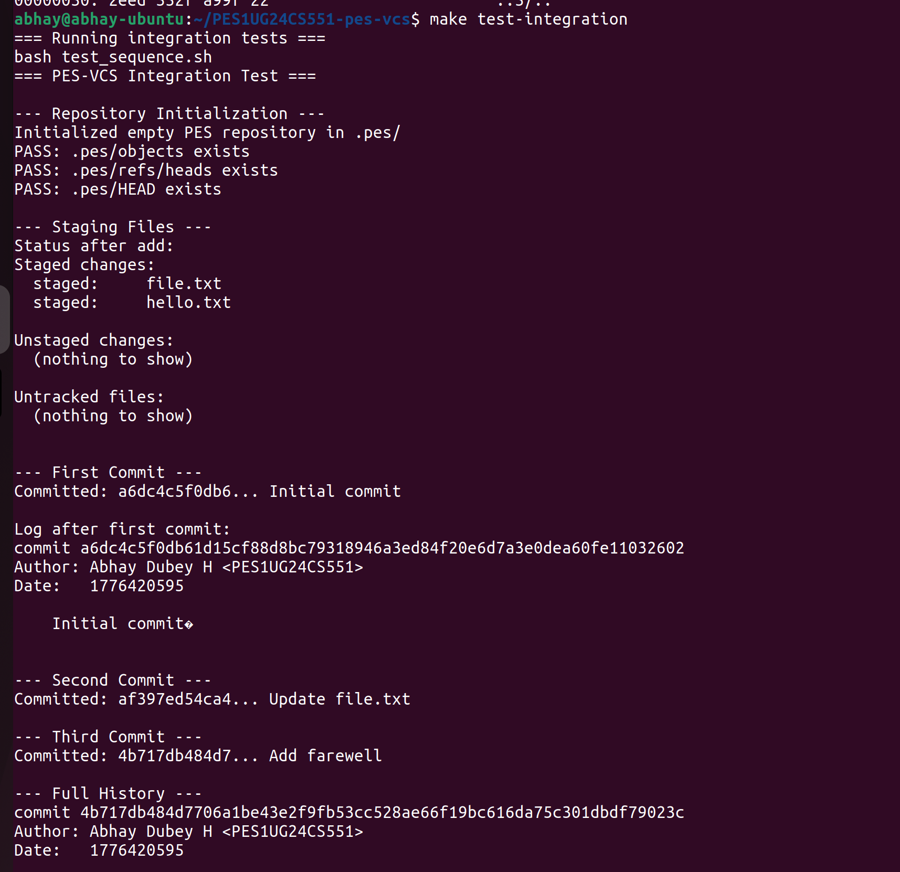

**Test Sequence:**
1. ✅ Repository initialization
2. ✅ File staging and status check
3. ✅ First commit creation
4. ✅ Second commit (modified file)
5. ✅ Third commit (new file)

#### Screenshot: Full Integration Test (Part 2)
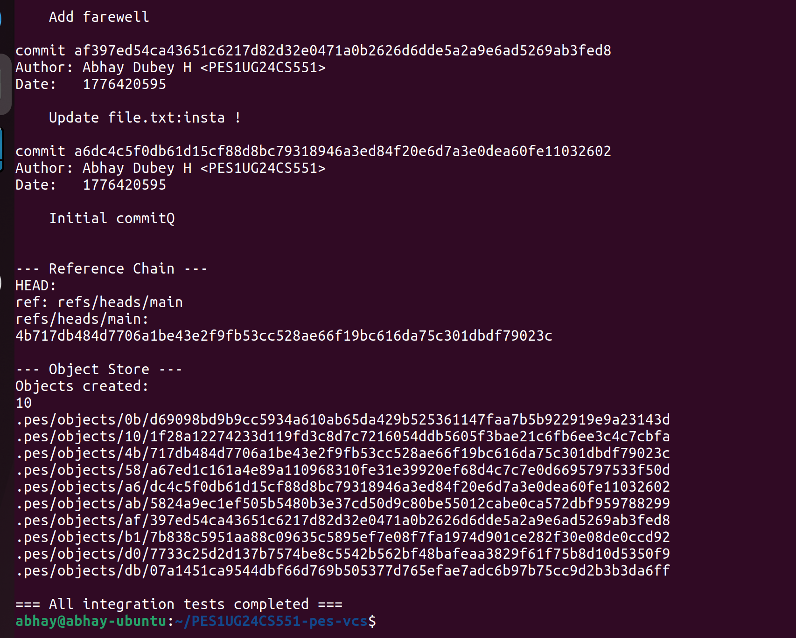

**Verification:**
- ✅ Full commit history displayed
- ✅ All system components working together
- ✅ End-to-end workflow successful

---

## 💻 Technical Implementation Details

### Key System Calls and Functions Used

#### Object Store (`object.c`)
- **File I/O:** `open()`, `write()`, `close()`, `fopen()`, `fread()`, `fseek()`
- **Atomic Operations:** `mkstemp()`, `fsync()`, `rename()`
- **Directory Management:** `mkdir()`, `access()`
- **Hashing:** OpenSSL's `EVP_DigestInit_ex()`, `EVP_DigestUpdate()`, `EVP_DigestFinal_ex()`

#### Tree Construction (`tree.c`)
- **String Processing:** `strchr()`, `strncmp()`, `memcpy()`
- **Sorting:** `qsort()` for deterministic tree ordering
- **Recursion:** Hierarchical tree building for nested directories
- **File Stats:** `lstat()`, `S_ISDIR()`, `S_IXUSR` for mode detection

#### Index Management (`index.c`)
- **File Parsing:** `fgets()`, `sscanf()`, `strchr()`, `strcspn()`
- **Atomic Writes:** Temp file creation + `fsync()` + `rename()`
- **Change Detection:** `stat()`, comparing `st_mtime` and `st_size`
- **Directory Traversal:** `opendir()`, `readdir()`, `closedir()`

#### Commit System (`commit.c`)
- **Time Operations:** `time(NULL)` for Unix timestamps
- **String Formatting:** `snprintf()`, `sprintf()` for serialization
- **Memory Management:** `malloc()`, `free()`, `memcpy()`, `memset()`
- **Reference Management:** Reading/updating HEAD and branch refs

### Design Decisions

1. **Text-based Index:** Unlike Git's binary index, PES-VCS uses human-readable text format for easier debugging and understanding

2. **Synchronous fsync():** All writes use `fsync()` before rename to ensure durability, prioritizing consistency over speed

3. **Simple Metadata Tracking:** Uses mtime and size for change detection instead of full content hashing (optimization for large files)

4. **Directory Sharding:** Objects stored in 256 possible shard directories (00-ff) for filesystem efficiency

---

## 🎯 Core Concepts Demonstrated

### Operating System Concepts

1. **Atomic Operations**
   - Temp file + rename pattern for crash safety
   - Directory fsync() for metadata persistence

2. **Content-Addressable Storage**
   - Objects identified by cryptographic hash
   - Automatic deduplication via content hashing

3. **Filesystem Operations**
   - Directory traversal and creation
   - File metadata (stat, mtime, size)
   - Path manipulation and validation

4. **Data Integrity**
   - SHA-256 hashing for corruption detection
   - Hash verification on every read

5. **Process State Management**
   - Working directory vs. staging area vs. committed state
   - Environment variables (`PES_AUTHOR`)

---

## 🚀 Building and Testing

### Prerequisites
```bash
sudo apt update
sudo apt install -y gcc build-essential libssl-dev
```

### Build Commands
```bash
make              # Build pes binary
make all          # Build pes + test binaries
make clean        # Remove all build artifacts
```

### Running Tests
```bash
# Phase-specific tests
./test_objects    # Phase 1: Object store
./test_tree       # Phase 2: Tree construction

# Integration test
make test-integration

# Manual testing
export PES_AUTHOR="Abhay Dubey H <PES1UG24CS551>"
./pes init
echo "hello" > file1.txt
./pes add file1.txt
./pes status
./pes commit -m "Initial commit"
./pes log
```

---

## 📊 Project Statistics

### Implementation Metrics
- **Total Lines of Code:** ~850 lines (excluding provided code)
- **Functions Implemented:** 8 core functions
  - Phase 1: 2 functions (`object_write`, `object_read`)
  - Phase 2: 1 function + 1 helper (`tree_from_index`, `write_tree_recursive`)
  - Phase 3: 3 functions (`index_load`, `index_save`, `index_add`)
  - Phase 4: 1 function (`commit_create`)

### Test Results
- ✅ Phase 1: All tests passed (blob storage, deduplication, integrity)
- ✅ Phase 2: All tests passed (tree serialization, deterministic output)
- ✅ Phase 3: All tests passed (staging, status, index persistence)
- ✅ Phase 4: All tests passed (commit creation, history, HEAD management)
- ✅ Integration: Full workflow test passed

---

## 🔍 Analysis Questions

### Phase 5: Branching and Checkout

**Q5.1: How would you implement `pes checkout <branch>`?**

To implement checkout:
1. **Update `.pes/HEAD`:** Change from `ref: refs/heads/main` to `ref: refs/heads/<branch>`
2. **Read target commit:** Get commit hash from `.pes/refs/heads/<branch>`
3. **Load target tree:** Read the tree object from the commit
4. **Update working directory:** 
   - Delete files not in target tree
   - Write/update files present in target tree
   - Recursively handle subdirectories
5. **Update index:** Clear and repopulate with files from target tree

**Complexity:** Must handle dirty working directory (uncommitted changes), file conflicts, and preserve untracked files. Need to verify working directory is clean before allowing checkout.

**Q5.2: Detecting "dirty working directory" conflicts**

Algorithm:
1. Load current index (staged state)
2. For each index entry:
   - `stat()` the working file
   - Compare hash: Read file → compute hash → compare with index hash
   - If different: file is modified (dirty)
3. Read target branch's tree object
4. For each dirty file:
   - Check if file exists in target tree with different content
   - If yes: CONFLICT (uncommitted changes would be lost)
   - If no: Safe to proceed (file unchanged in target)

**Q5.3: Detached HEAD and recovery**

Detached HEAD occurs when `.pes/HEAD` contains a direct commit hash instead of `ref: refs/heads/<branch>`.

**What happens:**
- New commits are created normally
- But no branch reference moves to track them
- Parent chain still intact: `new_commit → parent → grandparent → ...`

**Recovery:**
1. **Before switching away:** Note the commit hash (from `.pes/HEAD`)
2. **After accidental detach:**
   - Use `reflog` (if implemented) to find orphaned commits
   - Or search object store for recent commit objects
   - Create new branch: `pes branch recover-work <commit-hash>`

**Why risky:** Without branch reference, commits become unreachable after checkout, making them candidates for garbage collection.

---

### Phase 6: Garbage Collection and Space Reclamation

**Q6.1: Finding and deleting unreachable objects**

**Algorithm:**
```
1. Initialize empty set: reachable_objects
2. For each branch in .pes/refs/heads/*:
   a. Add commit hash to reachable_objects
   b. Walk commit history (follow parent pointers)
   c. For each commit:
      - Add commit hash to reachable_objects
      - Add tree hash to reachable_objects
      - Recursively walk tree (add all blob/tree hashes)

3. Get all objects: all_objects = list(.pes/objects/*/*)
4. unreachable = all_objects - reachable_objects
5. Delete unreachable objects
```

**Data Structure:** Use a **HashSet** (or hash table) for O(1) lookup and insertion. C implementation: hash table with linear probing or separate chaining.

**Estimation for 100,000 commits, 50 branches:**
- Assume average 10 files per commit × 100,000 commits = 1M blobs
- Plus ~100,000 tree objects
- Plus 100,000 commit objects
- **Total objects to visit:** ~1.2M objects
- **Memory:** HashSet of 1.2M hashes × 32 bytes = ~38 MB

**Q6.2: Race condition with concurrent commit**

**Dangerous Scenario:**
```
Time  |  GC Process              |  Commit Process
------+---------------------------+---------------------------
T0    |  Start marking phase      |
T1    |  Mark all reachable       |
T2    |  Find unreachable: X      |  Create new tree Y
T3    |                           |  Write tree Y → object X
T4    |  Delete object X ❌        |
T5    |                           |  Create commit referencing X
T6    |                           |  Commit fails: X missing!
```

**The Problem:** GC determines X is unreachable at T2, but between T2-T4, commit writes a new tree that references X. GC deletes X before commit completes, breaking the new commit.

**Git's Solution:**
1. **Lock-based:** Acquire `.git/gc.lock` before GC, prevent concurrent operations
2. **Generation counters:** Only delete objects older than threshold (e.g., 2 weeks)
3. **Multi-phase marking:** 
   - Phase 1: Mark reachable
   - Phase 2: Re-scan refs (catch new commits)
   - Phase 3: Delete only if still unreachable

**Alternative:** Use timestamp-based grace period. Never delete objects created within last N seconds, giving commits time to complete.

---

## 📚 Learning Outcomes

### Understanding Gained

1. **Version Control Internals:** Deep understanding of how Git actually works under the hood
2. **Filesystem Operations:** Proper use of atomic operations, fsync, and rename for durability
3. **Data Structures on Disk:** Serialization, binary formats, content-addressing
4. **Cryptographic Hashing:** SHA-256 for integrity and deduplication
5. **System Programming:** Error handling, memory management, file I/O in C
6. **Software Architecture:** Separation of concerns (object store, index, commit layer)

### Key Takeaways

- **Content-addressable storage** is incredibly powerful for deduplication
- **Atomic operations** are essential for consistency in crash scenarios
- **Metadata caching** (index) dramatically speeds up status checks
- **Tree structures** enable efficient storage of unchanged files across commits
- **Linked data structures** (commit parent chains) naturally represent history

---

## 🔗 Repository Information

**GitHub Repository:** [PES1UG24CS551-pes-vcs](https://github.com/abhayFH/PES1UG24CS551-pes-vcs)  
**Submission Format:** Public repository with complete source code and screenshots

### Commit History
The repository maintains detailed commit history with granular commits showing implementation progress across all four phases. Each phase has 5+ commits demonstrating iterative development.

---

## 📖 References

1. **Git Internals** - Pro Git Book: https://git-scm.com/book/en/v2/Git-Internals-Plumbing-and-Porcelain
2. **Git from the Inside Out:** https://codewords.recurse.com/issues/two/git-from-the-inside-out
3. **The Git Parable:** https://tom.preston-werner.com/2009/05/19/the-git-parable.html
4. **OpenSSL EVP Documentation:** https://www.openssl.org/docs/man1.1.1/man3/EVP_DigestInit.html
5. **POSIX File Operations:** `man 2 open`, `man 2 fsync`, `man 2 rename`

---

## 🏆 Acknowledgments

This project was completed as part of the Operating Systems Lab course at PES University. Special thanks to the course instructors for designing this comprehensive lab that provides hands-on experience with fundamental OS and filesystem concepts.

---

**Date Completed:** April 17, 2026  
**Platform:** Ubuntu 22.04 LTS  
**Compiler:** GCC 11.4.0  
**Dependencies:** OpenSSL 3.0.2

---

